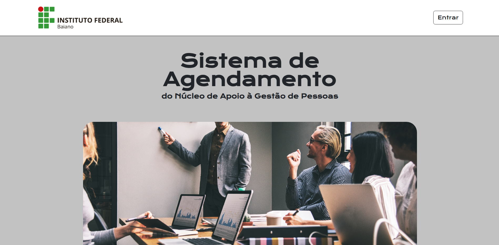

# 📅 Sistema de Agendamento

Aplicação web desenvolvida para o **Núcleo de Apoio à Gestão de Pessoas do IFBaiano**, com o objetivo de gerenciar o quadro de funcionários (Docentes e Técnicos Administrativos) e fornecer ferramentas de suporte, como um sistema de anotações pessoais para os usuários do sistema.

## Prévia

## Tecnologias Utilizadas

* **Linguagem:** Python 3
* **Framework:** Django
* **Banco de Dados:** SQLite
* **Segurança:** Django Authentication System
* **Frontend:** Bootstrap 5

## Funcionalidades

O sistema exige autenticação prévia para acesso a todas as rotas e apresenta os seguintes módulos:

* **Página Inicial (`/`):** Dashboard central do sistema.
* **Gestão de Técnicos (`/cadastros/tecnicos/`):**
  * Listagem com busca integrada.
  * Cadastro, edição e exclusão booleana de técnicos.
* **Gestão de Docentes (`/cadastros/docentes/`):**
  * Listagem com busca integrada.
  * Cadastro, edição e exclusão booleana de professores.
* **Bloco de Anotações (`/anotacoes/`):**
  * Sistema de notas privadas e exclusivas por usuário logado.
  * Criação, edição, exclusão e listagem.
  * Filtros de busca e ordenação dinâmica.